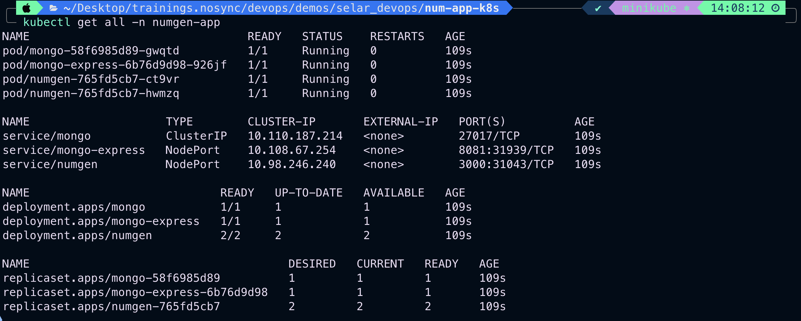
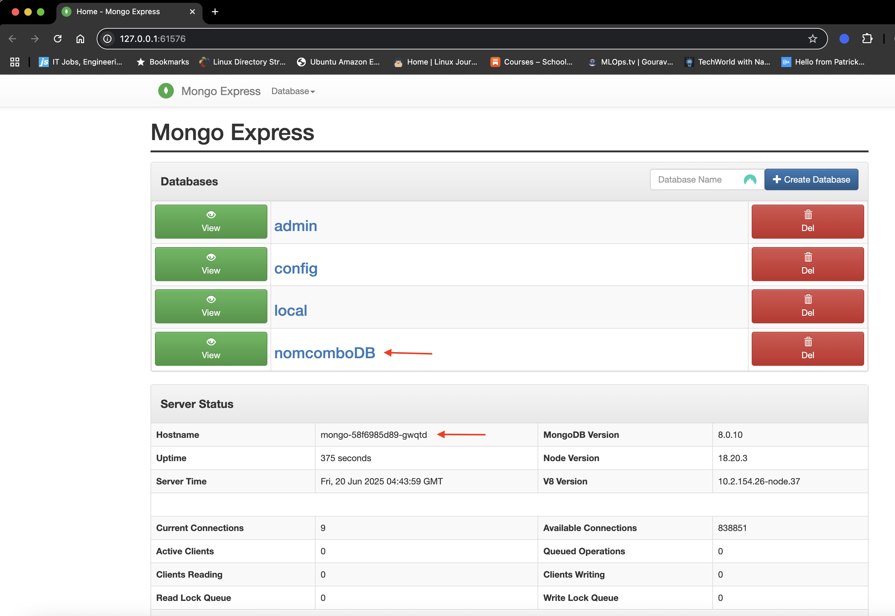
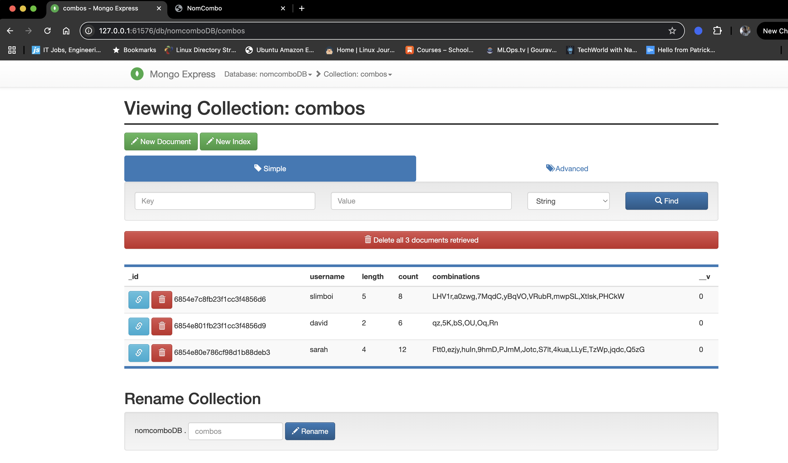
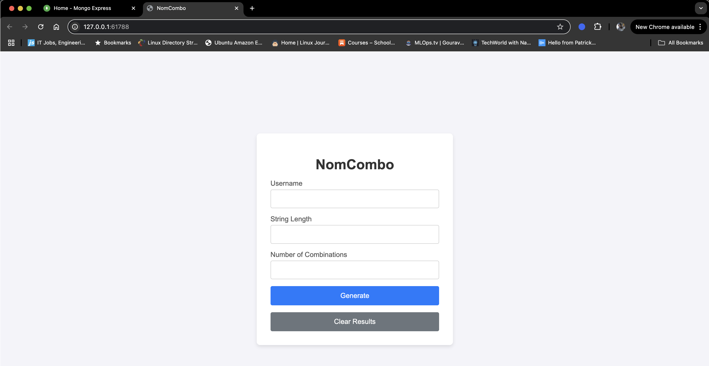

# Number Generator App Deployment to Minikube

## Prerequisites
- Minikube installed and configured
- kubectl CLI tool
- AWS CLI configured with ECR access
- Docker registry credentials for ECR

## Step 1: Start Minikube Cluster
```bash
minikube start
```

Verify cluster is running:
```bash
kubectl get nodes
```

## Step 2: Create Namespace and Secrets

### Create the namespace
```bash
kubectl create namespace numgen-app
```

Verify namespace creation:
```bash
kubectl get ns
```

### Create ECR secret for private image access
```bash
kubectl create secret docker-registry ecr-secret \
  --docker-server=475325513391.dkr.ecr.ap-southeast-2.amazonaws.com \
  --docker-username=AWS \
  --docker-password=$(aws ecr get-login-password --region ap-southeast-2) \
  --namespace=numgen-app
```

Verify secret creation:
```bash
kubectl get secrets -n numgen-app
```

## Step 3: Deploy Application Stack

Deploy all resources using the manifest file:
```bash
kubectl apply -f numgen-app-deploy.yaml
```

## Step 4: Verify Deployment

### Check all resources in the namespace
```bash
kubectl get all -n numgen-app
```

**Expected output showing all resources running:**


The output should show:
- **4 pods running**: 1 MongoDB, 1 Mongo Express, 2 NumGen replicas
- **3 services**: mongo (ClusterIP), mongo-express (NodePort:31939), numgen (NodePort:31043)
- **3 deployments**: All showing READY status
- **3 replicasets**: All with desired/current/ready pods matching

### Check PVC status
```bash
kubectl get pvc -n numgen-app
```

### Verify pods are running (should show all pods as Running and Ready)
```bash
kubectl get pods -n numgen-app
```

### Check pod logs if troubleshooting is needed
```bash
# MongoDB logs
kubectl logs -n numgen-app deployment/mongo

# Mongo Express logs  
kubectl logs -n numgen-app deployment/mongo-express

# Number generator app logs
kubectl logs -n numgen-app deployment/numgen
```

## Step 5: Access Applications

### Get service information
```bash
# View all services and their ports
kubectl get svc -n numgen-app
```

### Access Mongo Express (Database Management UI)
```bash
# This will automatically open the web interface
minikube service mongo-express -n numgen-app
```

**Mongo Express Interface:**


You can see the MongoDB databases including:
- `nomcomboDB` - Your application's database
- Standard MongoDB system databases (admin, config, local)

**Database Collections View:**


The `combos` collection shows your application data with:
- User combinations (slimboi, david, sarah)
- Generated strings with different lengths and counts
- Unique IDs and combination data

### Access Number Generator Application
```bash
# This will automatically open your application
minikube service numgen -n numgen-app
```

**Number Generator App Interface:**


The application provides:
- Username input field
- String length configuration
- Number of combinations setting
- Generate and Clear Results buttons

**Application in Action:**


Shows the success message: "Combinations generated and saved successfully!" after generating combinations for user "slimboi".

## Deployment Summary

### What was deployed:
- **Namespace**: `numgen-app` - Isolated environment for the application stack
- **MongoDB**: Database with persistent storage (1Gi PVC)
- **Mongo Express**: Web-based MongoDB management interface
- **Number Generator App**: Your application with 2 replicas for high availability

### Resource Configuration:
- **MongoDB**: 256Mi-512Mi memory, 250m-500m CPU
- **Mongo Express**: 128Mi-256Mi memory, 100m-200m CPU  
- **Numgen App**: 128Mi-256Mi memory, 100m-200m CPU (per replica)

### Services:
- **MongoDB**: ClusterIP (internal access only)
- **Mongo Express**: NodePort (external access via minikube)
- **Numgen App**: NodePort (external access via minikube)

## Cleanup (Optional)

To remove the entire deployment:
```bash
kubectl delete namespace numgen-app
```

## Troubleshooting

### If pods are not starting:
```bash
# Check pod status and events
kubectl describe pods -n numgen-app

# Check if ECR secret is working
kubectl get events -n numgen-app
```

### If services are not accessible:
```bash
# Check service endpoints
kubectl get endpoints -n numgen-app

# Verify minikube tunnel (if needed)
minikube tunnel
```