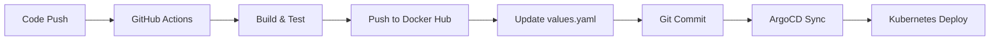
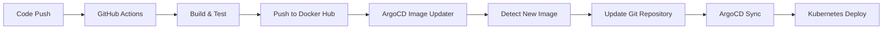

# 🔄 CI/CD Implementation Approaches

This project demonstrates two different approaches to implementing automated deployments in a GitOps workflow. Both methods were implemented and evaluated to understand their trade-offs in real-world scenarios.

## 📊 Approach Comparison

| Aspect | GitHub Actions Helm Update | ArgoCD Image Updater |
|--------|---------------------------|---------------------|
| **Complexity** | ⭐⭐ Simple | ⭐⭐⭐⭐ Complex |
| **Setup Time** | ~15 minutes | ~2 hours |
| **Debugging** | ✅ Easy (GitHub logs) | ❌ Complex (multiple components) |
| **Reliability** | ✅ Stable | ⚠️ Beta software issues |
| **GitOps Purity** | ⚠️ CI writes to Git | ✅ External tool manages Git |
| **Maintenance** | ✅ Low overhead | ❌ Additional component to maintain |
| **Team Understanding** | ✅ Familiar GitHub Actions | ❌ Requires ArgoCD expertise |

## 🚀 Approach A: GitHub Actions Helm Update (Recommended)

**Implementation Philosophy:** Simple, reliable CI/CD pipeline where GitHub Actions handles both building and deployment updates.

### Architecture Flow


### Implementation

#### 1. Complete CI/CD Pipeline
```yaml
# .github/workflows/ci.yml
name: Node.js CI with Docker + Docker Hub + Helm Update
on:
  push:
    branches:
      - main
      - feature/*
    paths-ignore:
      - '*.md'
      - '.gitignore'
  workflow_dispatch:

permissions:
  contents: write

jobs:
  checkout:
    name: Checkout Code
    runs-on: ubuntu-latest
    outputs:
      short_sha: ${{ steps.set-sha.outputs.short_sha }}
    steps:
      - name: Checkout Repo
        uses: actions/checkout@v4
      - name: Set Short SHA
        id: set-sha
        run: echo "short_sha=${GITHUB_SHA::7}" >> "$GITHUB_OUTPUT"

  lint:
    name: ESLint Check
    runs-on: ubuntu-latest
    needs: checkout
    steps:
      - uses: actions/checkout@v4
      - uses: actions/setup-node@v4
        with:
          node-version: '20'
      - run: npm ci
        working-directory: app-docker-multistage
      - run: npm run lint
        working-directory: app-docker-multistage

  test:
    name: Run Tests
    runs-on: ubuntu-latest
    needs: lint
    steps:
      - uses: actions/checkout@v4
      - uses: actions/setup-node@v4
        with:
          node-version: '20'
      - run: npm ci
        working-directory: app-docker-multistage
      - run: npm test
        working-directory: app-docker-multistage

  docker:
    name: Build & Push Docker Image
    runs-on: ubuntu-latest
    needs: test
    steps:
      - uses: actions/checkout@v4
      
      - name: Login to Docker Hub
        uses: docker/login-action@v3
        with:
          username: ${{ secrets.DOCKERHUB_USERNAME }}
          password: ${{ secrets.DOCKERHUB_TOKEN }}
      
      - name: Build and Push Docker Image
        working-directory: app-docker-multistage
        env:
          DOCKERHUB_USERNAME: ${{ secrets.DOCKERHUB_USERNAME }}
          REPOSITORY_NAME: ${{ secrets.REPOSITORY_NAME }}
        run: |
          SHORT_SHA=${GITHUB_SHA::7}
          IMAGE=$DOCKERHUB_USERNAME/$REPOSITORY_NAME:$SHORT_SHA
          docker build -t $IMAGE .
          docker push $IMAGE
          echo "Image pushed: $IMAGE"

  update-helm:
    name: Update Helm Chart
    runs-on: ubuntu-latest
    needs: [checkout, docker]
    steps:
      - name: Checkout Repo
        uses: actions/checkout@v4
        with:
          fetch-depth: 0
          token: ${{ secrets.GITHUB_TOKEN }}
      - name: Set up Git Identity
        run: |
          git config --global user.name "GitHub Actions"
          git config --global user.email "actions@github.com"
      - name: Update Helm Chart with new image tag
        env:
          SHORT_SHA: ${{ needs.checkout.outputs.short_sha }}
        run: |
          # Update only the numgen image tag
          sed -i '/numgen:/,/mongoExpress:/ { /tag:/ { s/tag:.*/tag: "${{ env.SHORT_SHA }}"/; } }' ./numgen-stack/values.yaml
          git add ./numgen-stack/values.yaml
          git commit -m "Updated numgen image tag to ${{ env.SHORT_SHA }} [skip ci]"
          git push
```

#### 2. ArgoCD Application Configuration
```yaml
# argocd-application.yaml
apiVersion: argoproj.io/v1alpha1
kind: Application
metadata:
  name: numgen-app
  namespace: argocd
  labels:
    app: numgen
spec:
  project: default
  source:
    repoURL: git@github.com:slimboi/NodeJS-NumberGeneratorApp.git
    targetRevision: main
    path: numgen-stack
    helm:
      valueFiles:
        - values.yaml
  destination:
    server: "https://kubernetes.default.svc"
    namespace: numgen-app
  syncPolicy:
    automated:
      prune: true
      selfHeal: true
    syncOptions:
      - CreateNamespace=true
    retry:
      limit: 5
      backoff:
        duration: 5s
        factor: 2
        maxDuration: 3m
```

### ✅ Advantages
- **Simple and Direct**: Easy to understand workflow
- **Reliable**: Uses stable, well-tested GitHub Actions
- **Fast Setup**: ~15 minutes to implement
- **Easy Debugging**: All logs in one place (GitHub Actions)
- **Team Friendly**: Most developers understand GitHub Actions
- **Immediate Feedback**: Can see the entire pipeline in GitHub UI

### ⚠️ Considerations
- CI system writes directly to Git (less "pure" GitOps)
- Requires `[skip ci]` to prevent infinite loops
- GitHub Actions needs write permissions to repository

---

## 🛠️ Approach B: ArgoCD Image Updater (Advanced)

**Implementation Philosophy:** Pure GitOps approach where an external tool manages image updates independently from the CI pipeline.

### Architecture Flow


### Implementation

#### 1. Install ArgoCD Image Updater
```bash
# Install ArgoCD Image Updater
kubectl apply -n argocd -f https://raw.githubusercontent.com/argoproj-labs/argocd-image-updater/stable/manifests/install.yaml

# Wait for Image Updater to be ready
kubectl wait --for=condition=available --timeout=300s deployment/argocd-image-updater -n argocd

# Verify installation
kubectl get pods -n argocd | grep image-updater
```

#### 2. Configure SSH Access
```bash
# Generate SSH key for ArgoCD
ssh-keygen -t ed25519 -C "your.email@example.com"

# Add public key to GitHub
cat ~/.ssh/id_ed25519.pub

# Configure ArgoCD repository with SSH private key
# ArgoCD UI → Settings → Repositories → Connect Repo
# Use SSH connection method with private key
```

#### 3. Simplified CI Pipeline (No Helm Updates)
```yaml
# .github/workflows/ci.yml (Image Updater version)
name: Node.js CI with Docker + Docker Hub
on:
  push:
    branches:
      - main
      - feature/*
    paths-ignore:
      - '*.md'
      - '.gitignore'
      - 'numgen-stack/values.yaml'
      - 'numgen-stack/.argocd-source-*.yaml'
  workflow_dispatch:

permissions:
  contents: read  # Reduced permissions

jobs:
  # ... build, lint, test jobs remain the same ...
  
  docker:
    name: Build & Push Docker Image
    runs-on: ubuntu-latest
    needs: test
    steps:
      - uses: actions/checkout@v4
      - name: Login to Docker Hub
        uses: docker/login-action@v3
        with:
          username: ${{ secrets.DOCKERHUB_USERNAME }}
          password: ${{ secrets.DOCKERHUB_TOKEN }}
      - name: Build and Push Docker Image
        working-directory: app-docker-multistage
        env:
          DOCKERHUB_USERNAME: ${{ secrets.DOCKERHUB_USERNAME }}
          REPOSITORY_NAME: ${{ secrets.REPOSITORY_NAME }}
        run: |
          SHORT_SHA=${GITHUB_SHA::7}
          IMAGE=$DOCKERHUB_USERNAME/$REPOSITORY_NAME:$SHORT_SHA
          docker build -t $IMAGE .
          docker push $IMAGE
          echo "Image pushed: $IMAGE"
  # No update-helm job - Image Updater handles this
```

#### 4. ArgoCD Application with Image Updater Annotations
```yaml
# argocd-application.yaml (Image Updater version)
apiVersion: argoproj.io/v1alpha1
kind: Application
metadata:
  name: numgen-app
  namespace: argocd
  annotations:
    # ArgoCD Image Updater Configuration
    argocd-image-updater.argoproj.io/image-list: numgen=slimboi/numcombo-app
    argocd-image-updater.argoproj.io/numgen.update-strategy: newest-build
    argocd-image-updater.argoproj.io/write-back-method: git
    argocd-image-updater.argoproj.io/git-repository: git@github.com:slimboi/NodeJS-NumberGeneratorApp.git
    argocd-image-updater.argoproj.io/git-branch: main
  labels:
    app: numgen
spec:
  # ... rest of spec remains the same ...
```

### ✅ Advantages
- **Pure GitOps**: External tool manages all Git operations
- **Separation of Concerns**: CI only builds, ArgoCD manages deployment
- **Advanced Features**: Supports complex update strategies
- **Industry Standard**: Used by many enterprise GitOps implementations

### ⚠️ Challenges Encountered
- **Complex Setup**: Requires SSH keys, annotations, additional debugging
- **Beta Software**: Encountered stability issues and documentation gaps
- **Parameter Override Files**: Creates `.argocd-source-*.yaml` instead of updating `values.yaml`
- **Debugging Difficulty**: Multiple components to troubleshoot
- **Infinite Loops**: Required careful path ignoring and commit message filtering
- **Learning Curve**: Requires deep ArgoCD knowledge

---

## 🎯 Implementation Decision & Learning Outcomes

### Technical Decision
After implementing both approaches, **Approach A (GitHub Actions Helm Update)** was selected as the primary implementation for the following reasons:

1. **Simplicity**: Easier to understand, implement, and maintain
2. **Reliability**: Uses stable, well-documented GitHub Actions
3. **Debugging**: Single point of failure with clear logging
4. **Team Adoption**: Lower barrier to entry for development teams
5. **Practical Benefits**: Immediate feedback and faster iteration

### Key Learning Insights

#### 🔍 When to Use Each Approach

**Use GitHub Actions Approach When:**
- Team is learning GitOps concepts
- Simple, reliable pipeline is priority
- Fast implementation is needed
- Debugging simplicity is important
- GitHub-centric workflow is preferred

**Use ArgoCD Image Updater When:**
- Pure GitOps compliance is required
- Complex image update strategies are needed
- Separation of CI/CD concerns is critical
- Enterprise-grade deployment governance is required
- Team has deep ArgoCD expertise

#### 📚 Technical Lessons Learned

1. **"Pure" GitOps isn't always practical** - Hybrid approaches can be more effective
2. **Beta software considerations** - Evaluate stability vs features carefully
3. **Complexity debt** - Additional components require additional maintenance
4. **Team capabilities matter** - Choose tools that match team expertise
5. **Incremental adoption** - Start simple, add complexity when justified

### 🗣️ Discussion Points for Technical Interviews

- **Problem-solving approach**: Systematic evaluation of multiple solutions
- **Trade-off analysis**: Understanding when to choose simplicity over "best practice"
- **Real-world experience**: Hands-on experience with both approaches
- **Technical decision making**: Data-driven choice between alternatives
- **DevOps maturity**: Understanding that tools should serve teams, not vice versa

## 🚀 Quick Start (Recommended Approach)

To implement the recommended GitHub Actions approach:

1. **Set up Docker Hub secrets** in your GitHub repository:
   - `DOCKERHUB_USERNAME`
   - `DOCKERHUB_TOKEN`
   - `REPOSITORY_NAME`

2. **Use the complete CI pipeline** from Approach A above

3. **Deploy ArgoCD application** with standard configuration (no Image Updater annotations)

4. **Test the workflow**:
   - Make code changes
   - Push to main branch
   - Watch GitHub Actions build and update values.yaml
   - Verify ArgoCD syncs the new image

## 📝 Repository Structure

Both implementations are maintained in the repository for reference:

```
├── .github/workflows/
│   ├── ci.yml                    # GitHub Actions approach
│   └── ci-image-updater.yml      # Image Updater approach (archived)
├── argocd-application.yaml       # Standard ArgoCD application
├── argocd-application-iu.yaml    # Image Updater version (archived)
├── numgen-stack/
│   ├── values.yaml              # Updated by GitHub Actions
│   └── .argocd-source-*.yaml    # Created by Image Updater (if used)
└── docs/
    └── image-updater-setup.md   # Detailed Image Updater documentation
```

This dual-implementation approach provides a comprehensive understanding of GitOps deployment strategies and demonstrates the ability to evaluate and choose appropriate tools based on practical requirements rather than theoretical ideals.